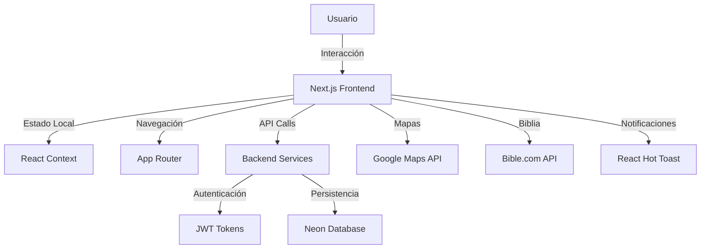

# 📚 Documentación Técnica - Monte Sion

## Índice de Contenidos

- [Arquitectura del Sistema](#arquitectura-del-sistema)
- [API y Backend](#api-y-backend)
- [Base de Datos](#base-de-datos)
- [Componentes Principales](#componentes-principales)
- [Hooks Personalizados](#hooks-personalizados)
- [Configuración de Servicios](#configuración-de-servicios)
- [Deployment y DevOps](#deployment-y-devops)
- [Troubleshooting](#troubleshooting)

## Arquitectura del Sistema

### Stack Tecnológico

```
┌─────────────────────────────────────┐
│            Frontend (Next.js)       │
│  ┌─────────────┬─────────────────┐  │
│  │   App Router │    Components   │  │
│  │   (Pages)    │    (UI/Logic)   │  │
│  └─────────────┴─────────────────┘  │
│           │                         │
│           │ HTTP/HTTPS              │
│           ▼                         │
│  ┌─────────────────────────────────┐ │
│  │         Auth Context            │ │
│  │      (JWT Management)           │ │
│  └─────────────────────────────────┘ │
└─────────────────────────────────────┘
           │
           │ REST API
           ▼
┌─────────────────────────────────────┐
│         Backend Services            │
│  ┌─────────────┬─────────────────┐  │
│  │ Auth Service │  Prayer Service │  │
│  │ (JWT/OAuth)  │  (Submissions)  │  │
│  └─────────────┴─────────────────┘  │
│           │                         │
│           │ PostgreSQL              │
│           ▼                         │
│  ┌─────────────────────────────────┐ │
│  │      Neon Database              │ │
│  │    (PostgreSQL Serverless)      │ │
│  └─────────────────────────────────┘ │
└─────────────────────────────────────┘
```

### Flujo de Datos



## API y Backend

### 🔐 Sistema de Autenticación

### Configuración del AuthProvider

El sistema utiliza React Context para manejar el estado global de autenticación:

```typescript
// app/auth-context.tsx
interface User {
  id: number
  nombre: string
  apellido: string
  correo_electronico: string
  is_active: boolean
}

interface AuthContextType {
  user: User | null
  loading: boolean
  error: string | null
  login: (correo_electronico: string, password: string) => Promise<void>
  register: (data: RegisterData) => Promise<void>
  logout: () => void
  requestPasswordReset: (correo_electronico: string) => Promise<void>
  confirmPasswordReset: (token: string, newPassword: string) => Promise<void>
  deleteAccount: () => Promise<void>
}
```

### Endpoints de Autenticación

**Base URL:** `${process.env.NEXT_PUBLIC_AUTH_URL || "https://montesion-backend.onrender.com/auth"}`

#### 1. Login
```
POST /token
Content-Type: application/x-www-form-urlencoded

Body: username={email}&password={password}
Response: { access_token: string }
```

#### 2. Registro
```
POST /register
Content-Type: application/json

Body: {
  nombre: string
  apellido: string
  correo_electronico: string
  password: string
}
```

#### 3. Obtener Usuario Actual
```
GET /auth
Authorization: Bearer {access_token}

Response: User object
```

#### 4. Recuperación de Contraseña
```
POST /password-reset
Content-Type: application/json

Body: { correo_electronico: string }
```

#### 5. Confirmar Reset de Contraseña
```
POST /password-reset/confirm
Content-Type: application/json

Body: {
  token: string
  new_password: string
}
```

#### 6. Eliminar Cuenta
```
DELETE /delete
Authorization: Bearer {access_token}
```

### Validación de Contraseñas

El sistema implementa validación robusta de contraseñas tanto en frontend como backend:

```typescript
const passwordRules = {
  length: password.length >= 8,
  uppercase: /[A-Z]/.test(password),
  lowercase: /[a-z]/.test(password),
  number: /\d/.test(password),
  specialChar: /[!@#$%^&*(),.?":{}|<>]/.test(password),
}
```

### Gestión de Tokens

- Los tokens JWT se almacenan en `localStorage` con la clave `access_token`
- La autenticación persiste entre sesiones del navegador
- Los tokens se envían en el header `Authorization: Bearer {token}`

## 📧 Sistema de Peticiones de Oración

### API de Peticiones

**Base URL:** `${process.env.NEXT_PUBLIC_PETICIONES_URL || "https://montesion.me/peticiones"}`

#### Endpoint Principal
```
POST /peticion
Content-Type: application/json

Body: {
  ticket: number (random ID)
  nombre: string (min. 2 caracteres)
  correo_electronico: string (formato email válido)
  asunto: string (min. 2 caracteres)
  peticion: string (min. 10 caracteres)
}
```

### Validación en Tiempo Real

El formulario incluye validación visual en tiempo real:

```typescript
const validarCampo = (field: string, value: string): boolean => {
  const val = value.trim();
  if (!val) return false;
  
  switch (field) {
    case "correo_electronico": 
      return /^[^\s@]+@[^\s@]+\.[^\s@]+$/.test(val);
    case "peticion": 
      return val.length >= 10;
    case "nombre":
    case "asunto": 
      return val.length >= 2;
    default: 
      return false;
  }
};
```

## 📧 Sistema de Newsletter

### API de Suscripción

**Base URL:** `${process.env.NEXT_PUBLIC_BACKEND_URL}`

```
POST /api/send-email
Content-Type: application/json

Body: { email: string }
Response: { success: boolean, message: string }
```

## 🗺️ Sistema de Mapas y Geolocalización

### Integración con Google Maps

El sistema utiliza la Google Maps JavaScript API para:

- Mostrar ubicaciones de templos
- Cálculo de distancias en tiempo real
- Búsqueda por nombre, dirección o código postal
- Detección automática de ubicación del usuario

### Configuración

```typescript
// Variables de entorno requeridas
NEXT_PUBLIC_GOOGLE_MAPS_API_KEY=your_api_key_here
```

### Funcionalidades Implementadas

1. **Búsqueda de Templos:**
   - Por nombre
   - Por dirección
   - Por código postal
   - Filtrado en tiempo real

2. **Cálculo de Distancias:**
   - Utiliza Google Maps Distance Matrix API
   - Muestra tiempo y distancia al templo más cercano
   - Actualización automática al cambiar ubicación

3. **Geolocalización:**
   - Solicita permisos de ubicación del usuario
   - Fallback a búsqueda manual si se deniegan permisos
   - Manejo de errores de geolocalización

## 🔒 Seguridad Implementada

### Validación de Entrada
- Sanitización de todos los inputs del usuario
- Validación de formatos de email
- Validación de longitud de campos
- Prevención de inyección XSS

### Autenticación
- Tokens JWT para sesiones
- Validación de tokens en cada request autenticado
- Logout automático en caso de tokens inválidos

### CORS y Headers de Seguridad
- Configuración CORS adecuada en el backend
- Headers de seguridad implementados
- Rate limiting en endpoints críticos

## 📊 Monitoreo y Analytics

### Métricas Implementadas
- Vercel Speed Insights para performance
- Error tracking y logging
- User analytics (privacy-compliant)
- Monitoreo de APIs externas

---

Esta documentación técnica cubre los aspectos más importantes del desarrollo y mantenimiento del proyecto Monte Sion. Para dudas específicas o contribuciones, consultar el README principal o contactar al equipo de desarrollo.
